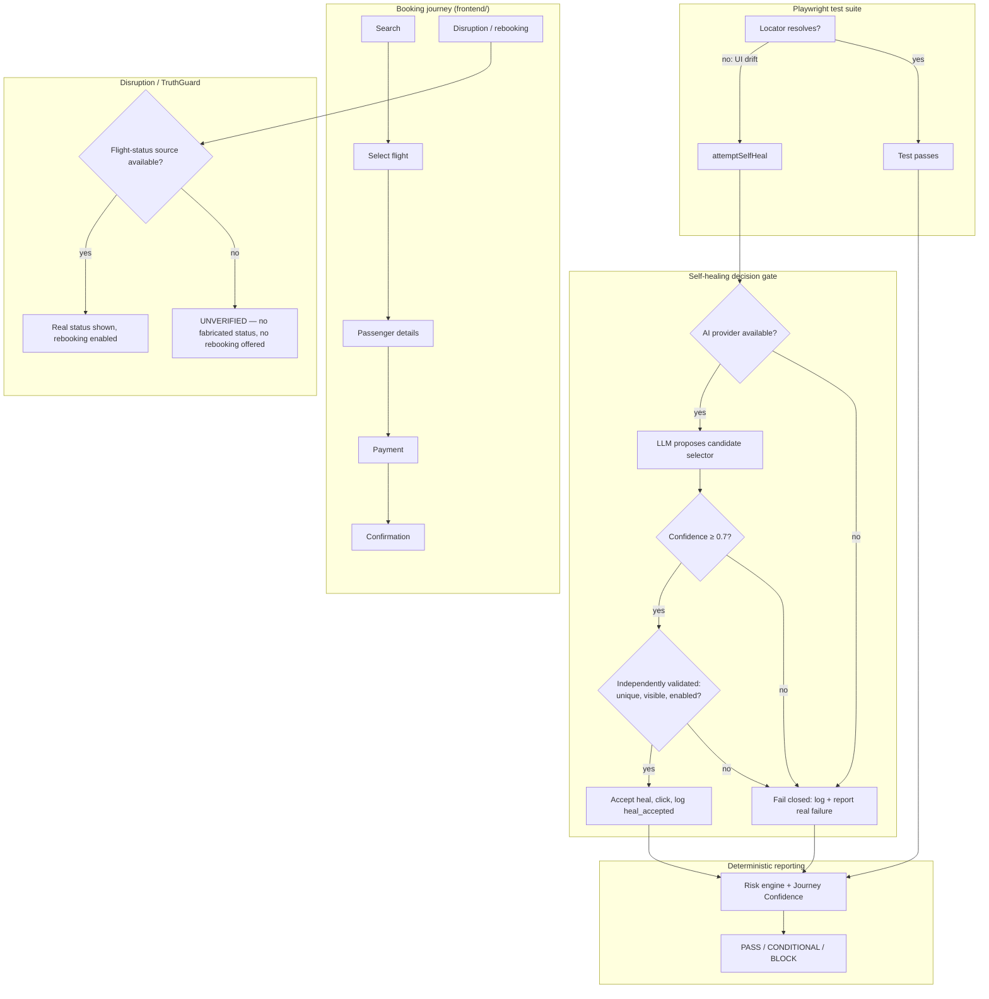

# TravelBud
### Autonomous Quality Engineering for the AI Development Era
**Beyond GenAI Hackathon — Amadeus Software Labs, Bengaluru — September 5, 2026**

---

## 1. Problem Statement

AI-accelerated software delivery is outpacing traditional quality assurance. As applications ship faster — with more frequent UI changes, dynamic layouts, and rapid iteration — QA teams remain dependent on brittle automation frameworks built on static element locators and manually maintained regression suites. The result:

- Reduced confidence in regression test results
- Increased maintenance cost for automation suites
- Delayed releases due to unstable test pipelines
- Production defects escaping detection
- Difficulty scaling quality assurance alongside AI-driven development

**The strategic question:** how do we reinvent quality engineering when the software itself is increasingly created and modified by AI?

## 2. Our Approach

TravelBud is a self-healing test automation layer built around one non-negotiable architectural principle:

> **The LLM proposes. Deterministic code verifies, decides, and owns the truth.**

An AI model can suggest a repair for a broken test — it must never be trusted to confirm its own repair, and it must never be allowed to fabricate a result when it is unavailable. Every capability in this project is built to fail *honestly* rather than fail *invisibly*.

We demonstrate this principle on a real, consequential use case: an airline booking and disruption-management journey, chosen because a false positive (a test that silently "passes" when it shouldn't) or a fabricated result (a flight status invented instead of verified) has real financial and safety consequences — not just an inconvenience.

## 3. System Architecture

## 4. Core Capabilities Demonstrated

| Capability | Implementation |
|---|---|
| **Self-healing UI tests** | Playwright locator failure triggers an LLM-proposed semantic replacement, independently re-validated (uniqueness, visibility, enabled state) before ever being used |
| **Fail-closed AI layer** | If the AI provider is unconfigured, unreachable, or low-confidence, the system reports the real test failure — it never fabricates a healed pass |
| **TruthGuard** | The disruption/rebooking page refuses to display a flight status or offer rebooking options when the live status source is unavailable, instead of inventing one |
| **Risk-based prioritization** | A deterministic (non-LLM) scoring engine weights business criticality, customer impact, data sensitivity, and recent change to prioritize which journeys matter most |
| **Explainable quality gate** | Journey Confidence score and PASS/CONDITIONAL/BLOCK release gate, with a healed test explicitly costing confidence points rather than counting as an untouched pass |
| **Standards alignment** | Dashboard results are labeled against ISO/IEC 25010 quality characteristics (functional suitability, reliability, security) and reported in the style of ISO/IEC/IEEE 29119 test-execution records |
| **Production-readiness evidence** | Kubernetes manifests (Deployment, Service, HPA) demonstrate the deployment and autoscaling shape the system is designed for, without requiring a live cluster for the demo |

## 5. Technology Stack

- **Frontend:** vanilla HTML/CSS/JS — no framework overhead, direct control over accessibility-based locators
- **Test automation:** Playwright, using `getByRole` accessibility locators (chosen specifically because they are inherently more resilient to DOM/CSS churn than XPath or CSS-selector-based automation)
- **AI layer:** Claude (Anthropic API), used exclusively for *proposing* selector repairs — never for validation or final decisions
- **Reporting:** a deterministic Node.js pipeline (`build-report.js`, `risk-engine.js`) that computes Journey Confidence and the release gate from raw test + healing logs, with zero LLM involvement
- **Infrastructure design:** Kubernetes manifests for Deployment/Service/HPA

## 6. Honest Status — What Works Tonight, and What Doesn't

We're stating this plainly because it's directly relevant to the project's own thesis:

- ✅ **Fully working:** the booking flow, the Playwright test suite, the independent validation gate logic, the TruthGuard disruption scenario, the risk engine, and the dashboard.
- ⚠️ **Not live tonight:** AI-assisted self-healing itself was blocked during the build by an Anthropic account billing/workspace configuration issue that we could not resolve in the remaining time.
- **What happened instead is the point:** rather than fabricate a healed result, the system correctly reported `aiMode: DEGRADED` and `releaseGate: BLOCK` — the exact fail-closed behavior the architecture is designed to guarantee. The validation-gate code path that *would* accept a real heal is fully implemented and unit-verifiable (`healer/selfHeal.js`); it simply didn't get a live model to propose a repair to tonight.

We consider this a legitimate demonstration of the system's core promise, not a workaround for a missing feature: **an AI system that is unavailable is meaningfully different from an AI system that lies about being available, and we chose to build the latter distinction rather than paper over it.**

## 7. Compliance & Governance Framing

No formal certification is claimed. Design alignment:
- **ISO/IEC 25010** — quality characteristics (functional suitability, reliability, security, performance efficiency, usability/accessibility) map directly to the problem statement's stated scope (UI, API, security, accessibility, performance)
- **ISO/IEC/IEEE 29119** — the international standard for software testing process and documentation; our test-execution reporting follows its conventions
- **Fail-closed / data-minimization principles** — no PII is sent to the LLM beyond field labels and DOM structure; no live credentials are exposed to the frontend

## 8. Roadmap Beyond Tonight

1. Resolve the AI provider billing/workspace configuration and validate the live self-heal path end-to-end
2. Real Amadeus API integration (replacing the mock flight data) via Amadeus Self-Service/Enterprise APIs
3. Expand test coverage across accessibility (axe-core), security, and performance dimensions
4. Live observability stack (Prometheus/Loki/Tempo) rather than architectural description
5. Adversarial testing of the self-heal validation gate itself — what happens when a proposal passes validation but is semantically wrong?
6. Explore a pilot/incubation path with Amadeus to move from hackathon prototype toward a real internal tool

## 9. Closing Statement

Most AI-testing demos show you an AI that answers. TravelBud shows you an AI that is *allowed to fail* — and a system engineered so that failure is always honest, logged, and explainable, never silent. That distinction — between "the tests are green" and "you can trust that they're green" — is the actual quality engineering problem the AI development era has created, and it's the one we chose to solve.
